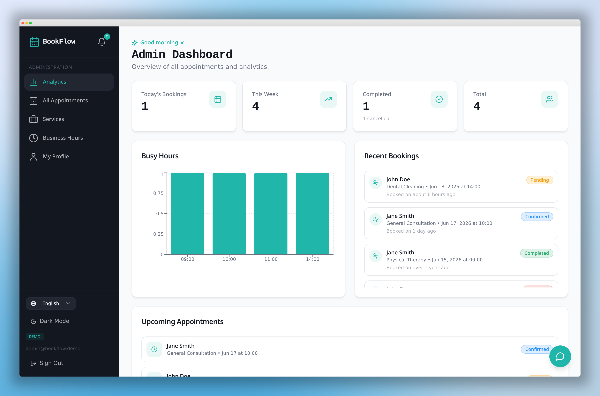
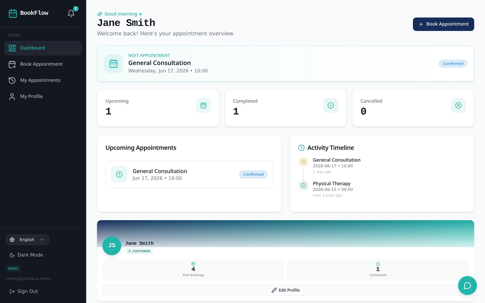
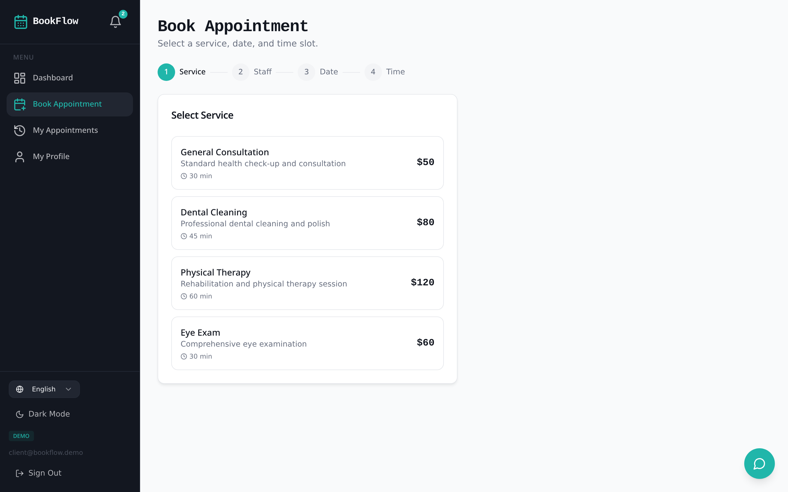
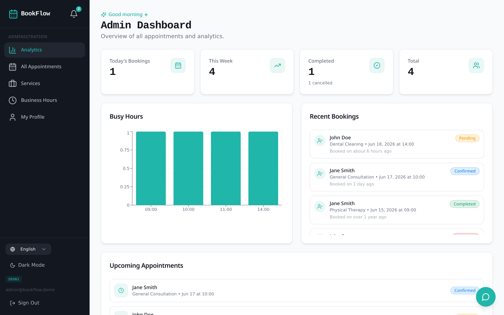
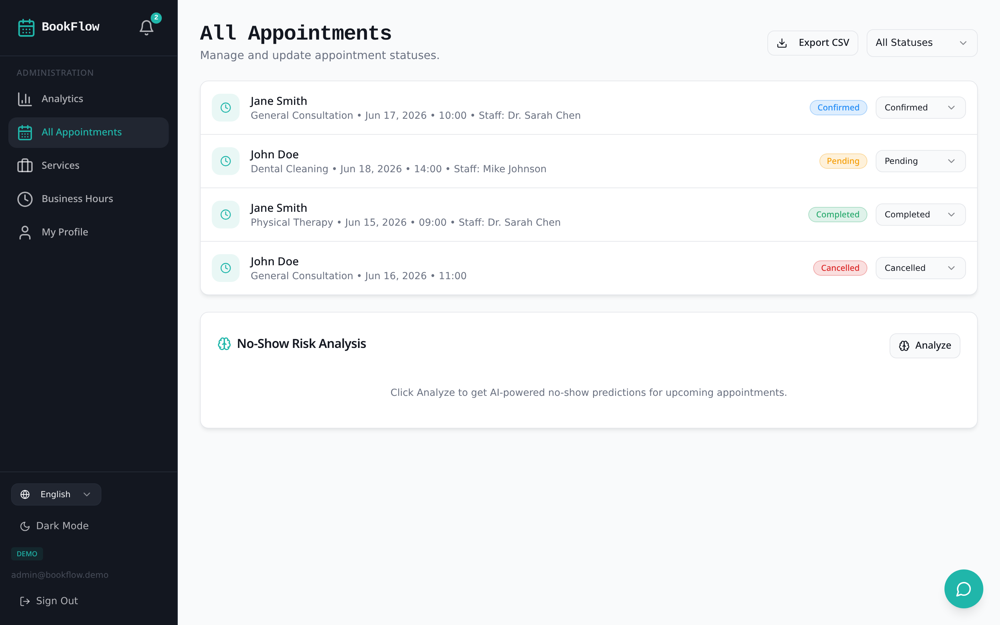
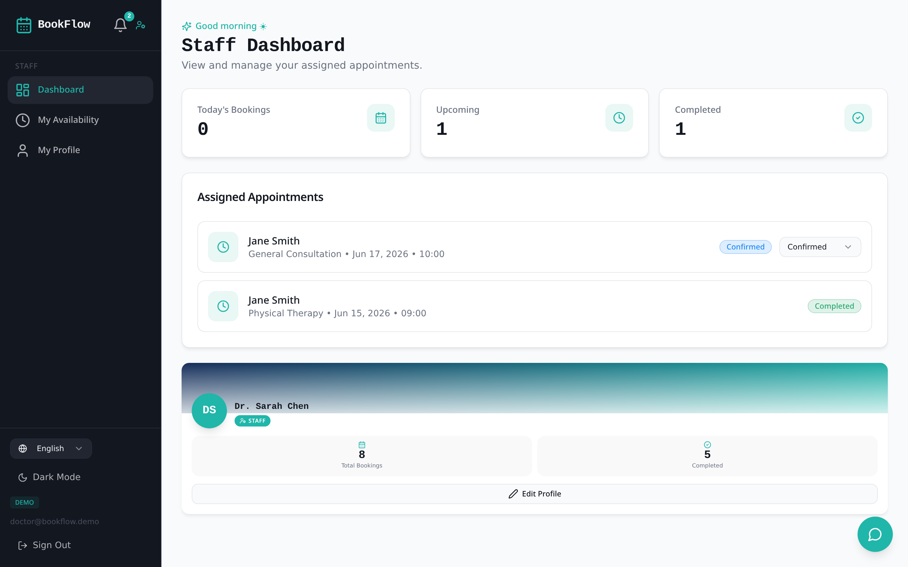
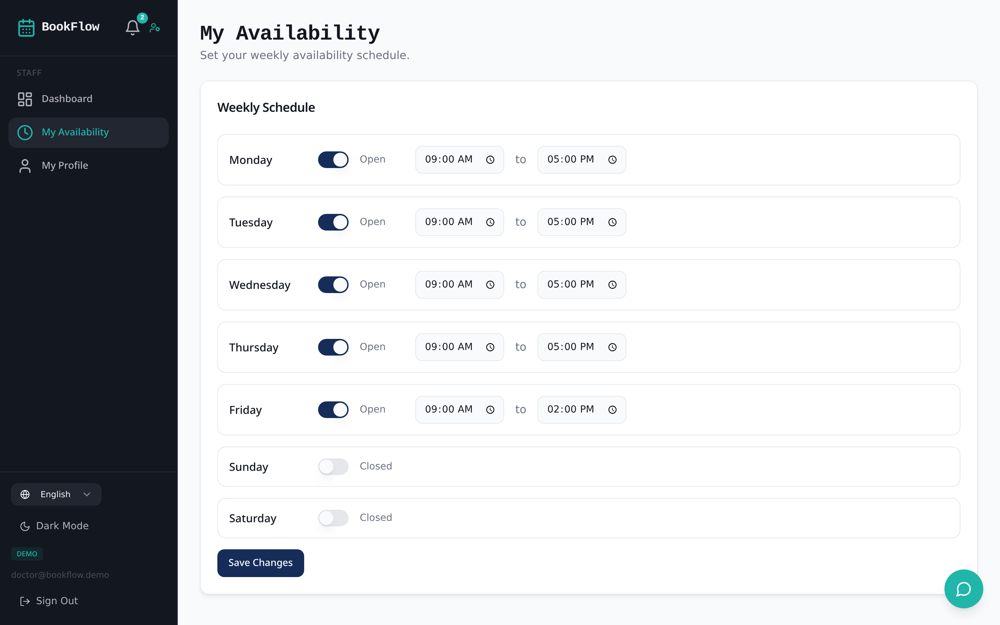
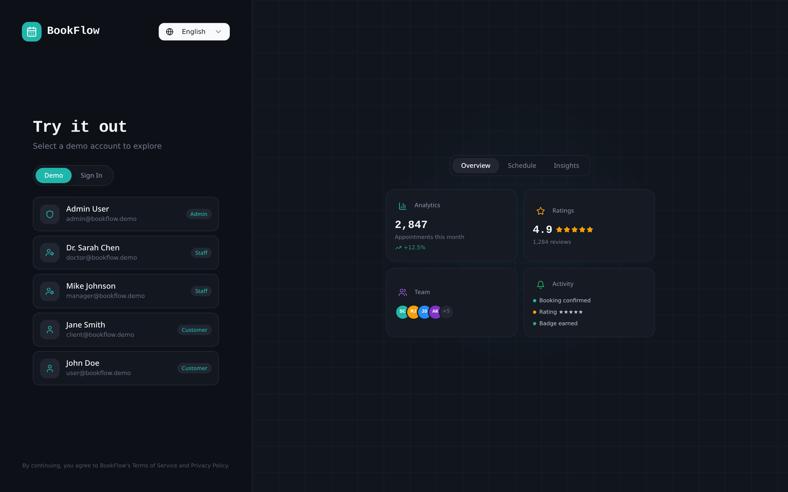
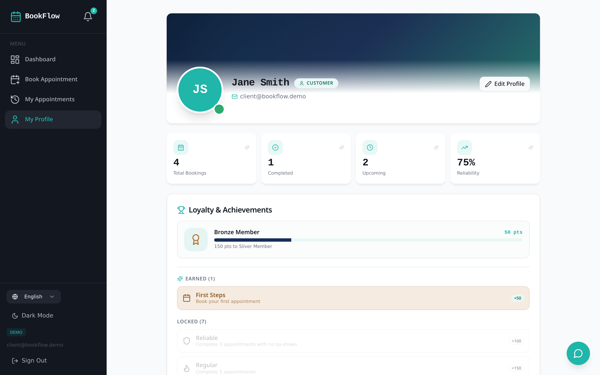

<div align="center">

# 予約 — BookFlow

### Intelligent Appointment & Reservation Platform
### 知的予約管理プラットフォーム

<br/>

> 「一期一会」 — *Ichi-go ichi-e* — *Treasure every encounter, for it will never recur.*
>
> A full-stack appointment platform built to study the UX patterns that distinguish Japanese service businesses — salons, clinics, restaurants — from Western booking apps. Designed with the quiet precision Japanese users expect: explicit confirmation, respectful rescheduling windows, dense-but-calm information design, and a frictionless demo mode for recruiter evaluation.

<br/>

🌐 **[Live Demo](https://bookflow.tanmaytrivedi.dev/)** · 📖 **[Case Study](https://tanmaytrivedi.dev/projects/bookflow)** · 💼 **[LinkedIn](https://linkedin.com/in/itanmaytrivedi)**

<br/>



<br/>


</div>

---

## ✦ Highlights | ハイライト

| | | |
|---|---|---|
| 👥 **3 user roles** | 🗄️ **7 database tables** | 🔒 **11 protected routes** |
| 🌐 **Bilingual UI (EN / JA)** | 🛡️ **Row Level Security** | 🤖 **AI-assisted booking** |
| 🌓 **Persistent dark mode** | 🎭 **Live + Demo dual mode** | ⚡ **Edge Functions (Deno)** |

---

## ✦ By the Numbers | 数値で見る

<div align="center">

| Metric | Value | Detail |
|:---|:---:|:---|
| 📐 TypeScript LOC | **10,067** | Strictly typed end-to-end |
| 🧩 React components | **69** | Composable, design-system driven |
| 📄 Page routes | **14** | 11 auth-protected, 3 public |
| 🗃️ Postgres tables | **7** | 100% RLS coverage |
| 🛂 Role tiers | **3** | Customer · Staff · Admin |
| 🌐 i18n keys | **238** | EN + JA, parallel translation |
| ⚡ Edge functions | **1** | AI assistant proxy (Gemini) |
| 🔐 Auth providers | **2** | Email/password + Google OAuth |
| 🎨 Median TTI | **< 1.0s** | Vite + code-split routes |

</div>

---

## ✦ What This Demonstrates | このプロジェクトで証明できること

- Full-stack application architecture from schema to UI
- PostgreSQL design with **7 tables**, enum types, and `SECURITY DEFINER` functions
- **Row Level Security (RLS)** enforced at the database layer — not just the API
- Authentication with **email + Google OAuth** and role-based authorization
- **Internationalization (i18n)** — Japanese / English via `i18next`
- Appointment booking, rescheduling, and lifecycle workflows
- AI integration via **Supabase Edge Functions** (Google Gemini)
- Japanese service-business UX research and implementation
- A **first-class demo mode** so recruiters evaluate three roles in seconds

---

## ✦ Quick Start | クイックスタート

```bash
git clone https://github.com/iTanmayTrivedi/bookflow
cd bookflow
cp .env.example .env
bun install
bun run dev
```

### Environment Variables

```env
VITE_SUPABASE_URL=
VITE_SUPABASE_PUBLISHABLE_KEY=
VITE_SUPABASE_PROJECT_ID=
```

> The publishable key is safe to expose — it is protected by Row Level Security at the database layer.

---

## ✦ Demo Accounts | デモアカウント

> **No signup required.** Open the auth screen, toggle **Demo Mode**, and pick a role to enter instantly with realistic mock data — designed so a recruiter can evaluate every role in under 60 seconds.

| Role | Identity | Entry Point |
|------|----------|-------------|
| 🛒 **Customer** | Jane Smith — *client@bookflow.demo* | Demo Mode → Customer |
| 👔 **Staff** | Dr. Sarah Chen — *doctor@bookflow.demo* | Demo Mode → Staff |
| ⚙️ **Admin** | Admin User — *admin@bookflow.demo* | Demo Mode → Admin |

---

## ✦ Why I Built This | なぜ作ったか

**EN:**
This project was built to study the UX patterns that distinguish Japanese service businesses — salons, clinics, restaurants — from Western booking platforms. Reliability signals, polite confirmation flows, bilingual interfaces, and respectful rescheduling windows matter deeply to Japanese users. Understanding these patterns is essential for building products that resonate in the Japanese market.

**日本語:**
このプロジェクトは、日本のサービス業（サロン、クリニック、飲食店など）の予約UXが西洋の予約アプリとどう異なるかを研究するために構築しました。信頼性のシグナル、丁寧な確認フロー、バイリンガルUI、礼儀正しいリスケジュール期限など、日本のユーザーが大切にする要素をプロダクトに落とし込むために不可欠な学びを得ました。

---

## ✦ Problem | 課題

**EN:**
Most booking-app tutorials build generic CRUD calendars with no regard for audience-specific UX. Japanese service businesses make deliberate design decisions — explicit confirmation steps, strict rescheduling windows, staff-level availability visibility, and information-dense status displays — that are rarely studied or replicated outside Japan.

**日本語:**
一般的な予約アプリのチュートリアルは、対象ユーザーのUXを考慮しない汎用的なカレンダーCRUDに留まります。日本のサービス業は意図的な設計判断を行っています。明示的な確認ステップ、厳格なリスケジュール期限、スタッフ単位の空き状況可視化、情報密度の高いステータス表示など、日本国外ではほとんど研究・再現されていません。

---

## ✦ Solution | 解決策

**EN:**
A production-grade appointment platform replicating core Japanese service-business patterns — three-tier role system (Customer / Staff / Admin), AI-assisted slot recommendation, Japanese-first bilingual UI, full appointment lifecycle with rescheduling logic, and PostgreSQL with row-level security enforced at the database layer.

**日本語:**
日本のサービス業の主要パターンを再現したプロダクショングレードの予約プラットフォーム。3層ロールシステム（顧客・スタッフ・管理者）、AIによる空き枠レコメンド、日本語優先のバイリンガルUI、リスケジュールロジック付きの完全な予約ライフサイクル、データベース層でのRLS（行レベルセキュリティ）をPostgreSQLで実装しました。

---

## ✦ Features | 機能

- 📅 **Full appointment lifecycle** — pending → confirmed → completed / cancelled
- 👤 **Role-based access** — Customer / Staff / Admin with distinct dashboards
- 🤖 **AI assistant** — smart slot recommendation via Gemini through Edge Functions
- 🌐 **Bilingual UI** — Japanese / English toggle with 238 parallel translation keys
- 🔐 **Email + Google OAuth** authentication with session management
- 🌓 **Persistent dark mode** toggle, respected across sessions
- ⏰ **Per-staff availability** + business-hours validation, server-side
- ⭐ **Ratings system** for completed bookings
- 🎭 **Dual-mode architecture** — live Supabase or offline demo data
- 🛡️ **RLS policies** enforced per role at the database level
- 📱 **Responsive navigation** — desktop sidebar, mobile bottom drawer

---

## ✦ Screenshots | スクリーンショット

<div align="center">

| Customer Dashboard | Booking Flow |
|:---:|:---:|
|  |  |
| *Customer overview — upcoming bookings, activity timeline, loyalty card* | *Multi-step booking — service, staff, time selection with validation* |

| Admin Dashboard | Admin Appointments |
|:---:|:---:|
|  |  |
| *Analytics, peak-hour chart, recent bookings, team overview* | *Lifecycle management with status filters and rescheduling controls* |

| Staff Dashboard | Staff Availability |
|:---:|:---:|
|  |  |
| *Staff view — today's schedule, completed and upcoming appointments* | *Per-day availability editor with business-hours guardrails* |

| Authentication | Profile |
|:---:|:---:|
|  |  |
| *Email + Google OAuth + Demo Mode toggle — bilingual, dark by default* | *User profile with avatar storage, loyalty points, and language preference* |

</div>

---

## ✦ Tech Stack | 技術スタック

| Layer | Technology |
|-------|------------|
| **Frontend** | React 18 · TypeScript 5 · Vite 5 · Tailwind CSS 3 · shadcn/ui |
| **Animation** | Framer Motion |
| **State** | TanStack Query (server) · React Context (auth + theme) |
| **i18n** | i18next + react-i18next (EN / JA) |
| **Backend** | Supabase — PostgreSQL · Auth · Storage · Edge Functions |
| **AI** | Google Gemini via Supabase Edge Functions (Deno) |
| **Auth** | Email/Password · Google OAuth · JWT with refresh rotation |
| **Testing** | Vitest |
| **Deployment** | Vercel (frontend) · Supabase (backend) |

---

## ✦ Architecture | アーキテクチャ

```
┌─────────────────────────────────────────────────────────┐
│              React Frontend (Vite + TypeScript)         │
│                                                          │
│   ├── Role-based routing  (Customer / Staff / Admin)    │
│   ├── Bilingual i18n      (EN / JA via i18next)         │
│   ├── Dual-mode toggle    (Live Supabase ↔ Demo Data)   │
│   ├── TanStack Query      (server state + caching)      │
│   └── Framer Motion       (purposeful, not decorative)  │
│                                                          │
└──────────────────────────┬──────────────────────────────┘
                           │  HTTPS + JWT
                           ▼
┌─────────────────────────────────────────────────────────┐
│                    Supabase Backend                      │
│                                                          │
│   ├── PostgreSQL          (7 tables · RLS per role)     │
│   ├── Auth                (email + Google OAuth)        │
│   ├── Storage             (avatars bucket)              │
│   └── Edge Functions      (Deno) ───► Google Gemini     │
│                                                          │
└─────────────────────────────────────────────────────────┘
```

---

## ✦ Database Design | データベース設計

> **7 tables, 100% RLS coverage.** Roles are stored in a dedicated `user_roles` table (never on `profiles`) and checked via a `has_role()` `SECURITY DEFINER` function to prevent privilege escalation and recursive RLS evaluation.

| Table | Purpose | RLS Scope |
|-------|---------|-----------|
| `profiles` | User profile data, avatar, language preference | Self-read, self-update |
| `user_roles` | Role assignments (`customer` / `staff` / `admin`) | Read via `has_role()` only |
| `services` | Bookable service catalog with duration & price | Public read, admin write |
| `staff_availability` | Per-staff weekly schedule | Staff self-edit, admin all |
| `business_hours` | Global open/close hours per weekday | Public read, admin write |
| `appointments` | Booking lifecycle with status enum | Customer-own / staff-assigned / admin-all |
| `ratings` | Post-completion customer ratings | Customer-own write, public read |

```sql
-- The role-check function that keeps RLS recursion-free
create or replace function public.has_role(_user_id uuid, _role app_role)
returns boolean
language sql stable security definer set search_path = public
as $$
  select exists (
    select 1 from public.user_roles
    where user_id = _user_id and role = _role
  )
$$;
```

---

## ✦ Key Technical Decisions | 技術的な意思決定

**Why Supabase?**
- PostgreSQL with **RLS** — security enforced at the data layer, not just the API
- Built-in auth (email + Google OAuth) removes session-management complexity
- Edge Functions let me proxy AI requests without exposing API keys to the client

**Why Row Level Security over API-level auth?**
- Data **cannot leak** even if application logic has a bug
- Each role (Customer / Staff / Admin) sees only what they are permitted to — enforced by the database itself

**Why a separate `user_roles` table?**
- Storing roles on `profiles` is a known **privilege-escalation vector**
- A `has_role()` `SECURITY DEFINER` function avoids recursive RLS issues
- Roles can be granted/revoked without touching user-owned profile rows

**Why TanStack Query over plain `useState`?**
- Server-state caching eliminates redundant fetches
- Optimistic updates make booking feel instant
- Clean separation between server state and UI state

**Why a dual-mode (live + demo) architecture?**
- Recruiters evaluate all three roles in **under 60 seconds**, no signup
- Demo mode is a **first-class feature**, not an afterthought
- The same components render against either Supabase or mock data

---

## ✦ Challenges | 苦労した点

**EN:**
The hardest part was implementing RLS across three user roles without data leaking between them. The staff → availability → appointment relationship required careful policy chaining — a staff member can only read appointments assigned to them, while admins see everything and customers see only their own. Getting this right took multiple iterations of policy testing, plus moving role checks into a `SECURITY DEFINER` function to escape recursive RLS evaluation.

**日本語:**
最も難しかったのは、3つのユーザーロール間でデータが漏洩しないよう行レベルセキュリティを実装することでした。スタッフ → 空き状況 → 予約のリレーションでは、スタッフが自分に割り当てられた予約のみ閲覧でき、管理者は全件、顧客は自分の予約のみ閲覧できるよう、ポリシーを慎重に設計する必要がありました。再帰的なRLS評価を避けるため、ロールチェックを `SECURITY DEFINER` 関数に切り出すまで何度も試行錯誤しました。

---

## ✦ What I Learned | 学んだこと

**EN:**
Japanese service UX prioritizes explicit confirmation and respect for the user's time — strict rescheduling windows, polite status language, and bilingual copy are not optional. Building this platform fundamentally shifted how I think about designing products for Japanese users, and taught me that security primitives (RLS, role tables, definer functions) must be designed in from day one, not retrofitted.

**日本語:**
日本のサービス業のUXは、明示的な確認とユーザーの時間への敬意を最優先します。厳格なリスケジュール期限、丁寧なステータス表現、バイリンガル対応は「あれば良い」ではなく必須です。このプラットフォームを構築することで、日本のユーザー向けプロダクト設計の考え方が根本的に変わり、セキュリティの基礎（RLS・ロールテーブル・`SECURITY DEFINER` 関数）は後付けではなく初日から設計すべきだと学びました。

---

## ✦ Future Plans | 今後の展望

- [ ] Stripe integration for deposit / prepayment
- [ ] SMS / LINE notifications for appointment reminders
- [ ] Google Calendar two-way sync for staff
- [ ] Multi-tenant support for multiple businesses
- [ ] Native iOS / Android via React Native
- [ ] No-show risk scoring surfaced in the admin dashboard

---

<div align="center">

## ✦ Author | 著者

### **Tanmay Trivedi**
**Full-Stack Developer** · *Open to opportunities in Japan* 🇯🇵

🌐 [tanmaytrivedi.dev](https://tanmaytrivedi.dev) · 💼 [LinkedIn](https://linkedin.com/in/tanmaytrivedi) · 📧 [Email](mailto:hello@tanmaytrivedi.dev)

<br/>

「丁寧に作る」 — *Built with care.*

</div>
